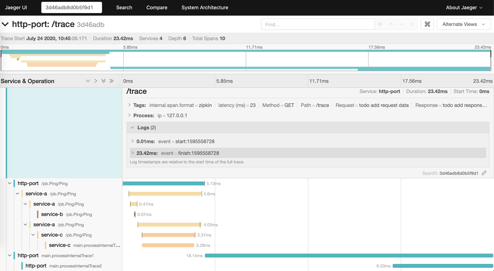
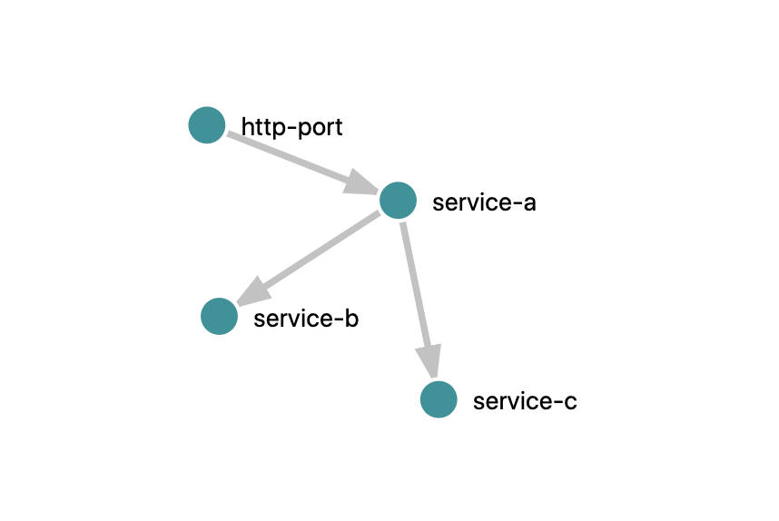

### Get started with jaeger.

1.Install `jaeger` `All in one`. You can then navigate to [http://localhost:16686](http://localhost:16686) to access the Jaeger UI.

```shell script
docker run -d --name jaeger \
  -e COLLECTOR_ZIPKIN_HTTP_PORT=9411 \
  -p 5775:5775/udp \
  -p 6831:6831/udp \
  -p 6832:6832/udp \
  -p 5778:5778 \
  -p 16686:16686 \
  -p 14268:14268 \
  -p 14250:14250 \
  -p 9411:9411 \
  jaegertracing/all-in-one:1.18
```

2.Ensure using jaeger tracer.

```go
import (
    xjaeger "github.com/yeqown/opentracing-practice/x/x-jaeger"
)

// path/to/opentraing-practice/x/boot.go
func BootTracerWrapper(localServiceName string, hostPort string) error {
    // replace here xjaeger.BootJaegerTracer
    tracer, err := xzipkin.BootZipkinTracer(localServiceName, hostPort) 
    // ...
}

// path/to/opentraing-practice/example/http/main.go
func main() {
    // ...
    
    // replace here into xjaeger.GetTraceIdFromSpanContext
    engi.Use(x.Opentracing(xzipkin.GetTraceIdFromSpanContext))
    
    // ...
}
```

3.Start servers

```sh
cd path/to/opentracing-practice

# server-c
go run example/server-c/main.go

# server-b
go run example/server-b/main.go

# server-a
go run example/server-b/main.go

# http-server
go run example/http/main.go
```

OR 

```
cd path/to/opentracing-practice

make run
```

3.Client do request.

```shell script
curl http://127.0.0.1:8080/trace
```

OR.
visit [http://127.0.0.1:8080/trace](http://127.0.0.1:8080/trace) in your browser.

4.Get traceId.

    from `conosole log` or `client response header`

### Result shots

##### trace timeline


##### trace chain(cross server and process internal)


##### system architecture

